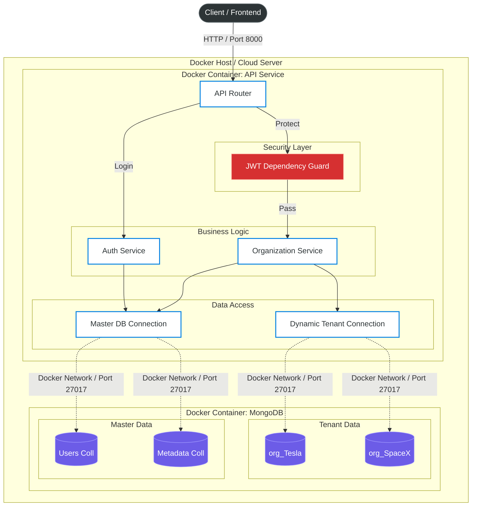

# 🏢 Organization Management Service

> A robust, multi-tenant backend service built with **FastAPI** and **MongoDB**, featuring dynamic collection-based tenancy, secure authentication, and scalable architecture.

## 📖 Overview
This project implements a **Multi-Tenant SaaS Architecture** where each organization's data is isolated in its own MongoDB collection. It provides a RESTful API for managing organizations, handling secure Admin authentication (JWT), and dynamically syncing data across collections during updates.

---

## 📂 Project Structure

```text
backend-assignment/
├── app/
│   ├── core/           # Config & Security (JWT/Hashing)
│   ├── database/       # MongoDB Connection Logic
│   ├── models/         # Pydantic Schemas
│   ├── routes/         # API Endpoints
│   ├── services/       # Business Logic
│   └── main.py         # Entry Point
├── .env                # Secrets (Ignored by Git)
├── .gitignore
├── Dockerfile          # Docker Image Configuration
├── docker-compose.yml  # Container Orchestration
├── requirements.txt
└── README.md
```
---

## 🏗️ High-Level Architecture

The system follows a **Collection-Based Multi-Tenancy** model. A central `Master DB` holds the routing logic and authentication data, while dynamic collections are spawned for each new tenant.



---

## 🚀 Features

* **Multi-Tenancy:**  
  Automatic creation of dedicated collections (`org_<name>`) for data isolation.

* **Secure Authentication:**  
  - JWT (JSON Web Tokens) for stateless session management  
  - Bcrypt hashing for password security

* **Dynamic Operations:**  
  - Create Organization (spawns new collection)  
  - Update Organization (renames collection & syncs metadata)  
  - Delete Organization (cascading delete of Admin, Metadata, Data)

* **Documentation:**  
  Auto-generated interactive API docs via Swagger UI.

---

## 🛠️ Tech Stack

* **Framework:** Python 3.10+, FastAPI  
* **Database:** MongoDB (via PyMongo)  
* **Containerization:** Docker, Docker Compose
* **Security:** PyJWT, Passlib, Bcrypt  
* **Server:** Uvicorn (ASGI)

---

## 🐳 Docker Setup (Recommended)

### Prerequisites
* Docker Desktop installed and running

### Run the Application

```bash
docker-compose up --build
```

API: http://localhost:8000  
MongoDB: localhost:27017

---

## ⚙️ Manual Local Setup (Alternative)

### Prerequisites
* Python 3.10+
* MongoDB (local or Atlas)

### Clone Repository

```bash
git clone https://github.com/Gautham07s/org-management.git
cd org-management
```

### Virtual Environment

```bash
# Windows
python -m venv venv
source venv/bin/activate  # Mac/Linux
```

### Install Dependencies

```bash
pip install -r requirements.txt
```

### Environment Variables

```env
MONGO_URI=mongodb://localhost:27017
DB_NAME=master_db
SECRET_KEY=replace_this_with_a_secure_random_string
ALGORITHM=HS256
```

### Run Server

```bash
uvicorn app.main:app --reload
```

The server will start at:  
**http://127.0.0.1:8000**

---


## 📚 API Documentation

FastAPI provides an automatic, interactive documentation page.

1. Run the server.  
2. Open your browser to:  
   **http://127.0.0.1:8000/docs**

---

### Key Endpoints

| Method | Endpoint        | Description                         | Auth Required |
|--------|------------------|---------------------------------------|---------------|
| POST   | `/org/create`    | Register a new Organization           | ❌ |
| POST   | `/admin/login`   | Login and get Access Token            | ❌ |
| GET    | `/org/get`       | Fetch Org details by name             | ❌ |
| PUT    | `/org/update`    | Rename/Update Org & Sync Data         | ✅ |
| DELETE | `/org/delete`    | Delete Org and all its Data           | ✅ |

---

## 💡 Design Choices & Trade-offs

### 1. Why FastAPI?

* **Speed:** Comparable to Node.js/Go  
* **Productivity:** Built-in validation (Pydantic) and API docs  
* **Async:** Native asynchronous support for database operations  

---

### 2. Database Architecture: Collection-Based Tenancy

* **Decision:** Use a dynamic collection per organization  
* **Benefits:**  
  - Better data isolation than Row-based tenancy  
  - Easier backups and deletions than Database-per-tenant  
  - Ideal “middle ground” for medium-scale SaaS  
* **Trade-off:**  
  At extremely large scale (10,000+ orgs), MongoDB may hit limits on collection count.  
  Future migration: **Sharded database-per-tenant** architecture.

---

### 3. Modular Code Structure

The project follows a Service-Repository pattern:

```
routes → services → database → models
```

This ensures the codebase is clean, maintainable, and testable.

---
